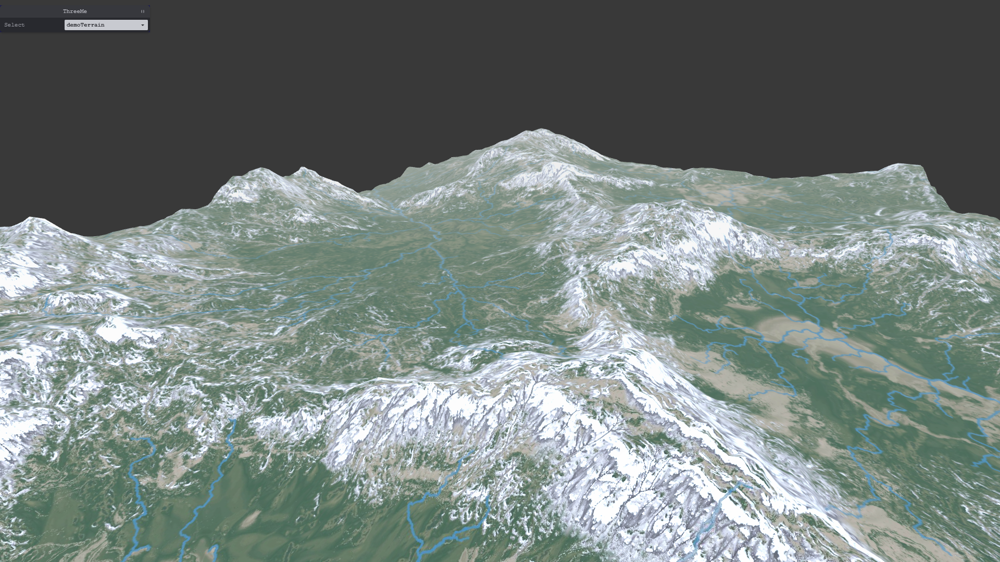
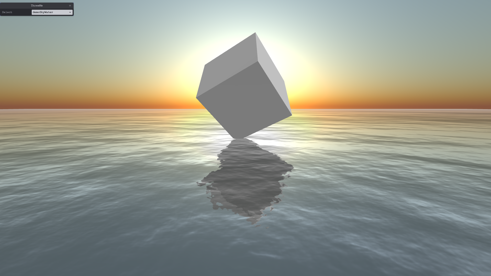
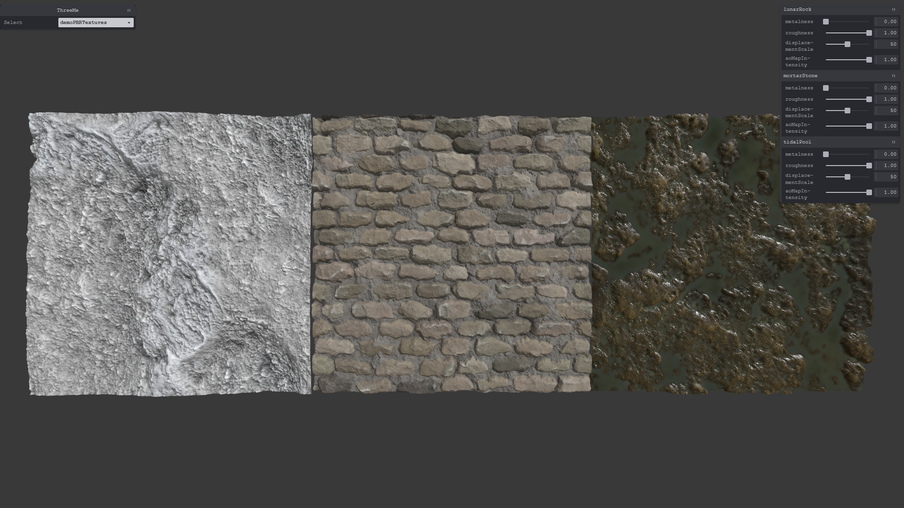
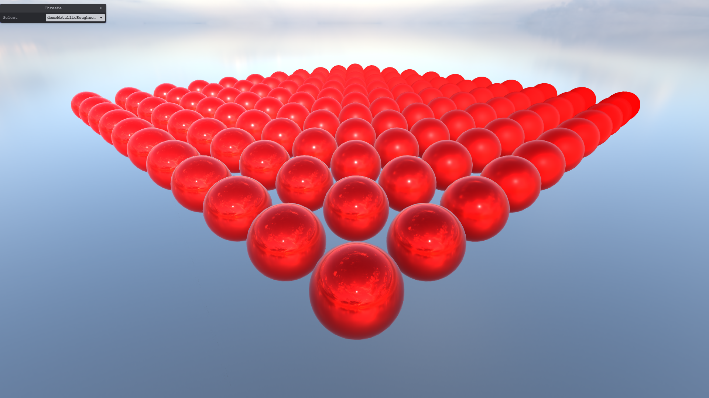

# ThreeMe

**ThreeMe** is a [three.js](https://threejs.org/)-based graphics engine that simplifies 3D model rendering for effortless and efficient visuals.

## Overview
**ThreeMe** is a powerful graphics engine built on [three.js](https://threejs.org/), designed to streamline 3D model rendering with ease and efficiency. It simplifies complex 3D rendering processes, enabling developers to create stunning visuals effortlessly.

## Demo examples

You can explore the [demo](https://jamhpark.github.io/threeMe) examples created by using *threeMe*. Some of the examples are shown below.

## Benefits from threeMe

Through *threeMe*, you can gain the following insights:

- A comprehensive understanding of the fundamental structure, core functions, and key features of *three.js*.
- The *threeMe* class streamlines and optimizes essential components for 3D rendering, enhancing efficiency and performance.
- By leveraging these optimizations, users can concentrate exclusively on refining their 3D models, thereby elevating their model's quality.
- Moving forward, the *threeMe* library is set to expand into animation and simulation, broadening its scope and capabilities.

## Contributing

All contributions are welcome as well as donations! Please contact us at jamhpark@gmail.com for any questions or suggestions. Thank you [sangkunine](https://github.com/sangkunine) for your mentorship.

## License

This project is licensed under the MIT license.